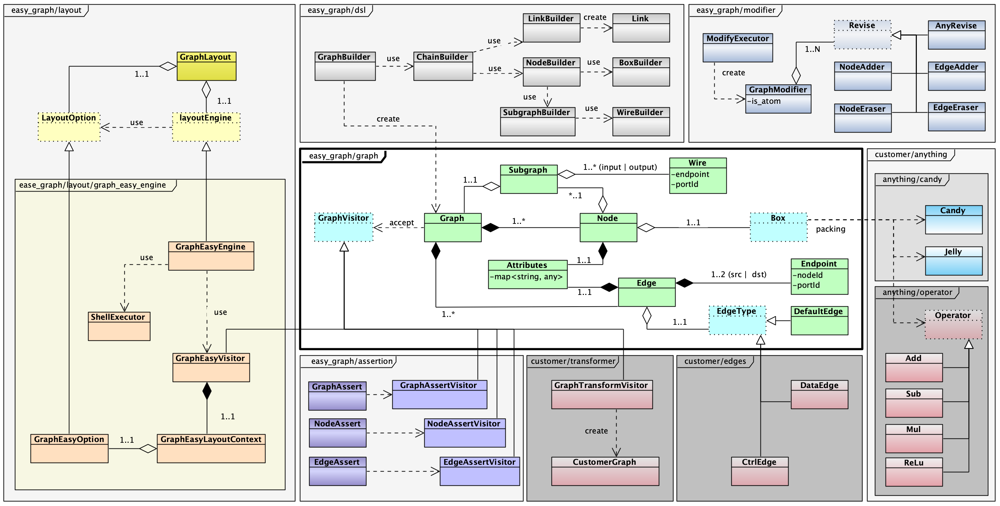

## Easy Graph

Easy graph is a C++ library for describing graph topology and attributes by DSL;
It support layouting the graph in console using `Graph-Easy` module of perl;
It also support asserting the graph topology and attributes.

### Layout

Intall `Graph::Easy` module of perl for graph layout.

```sh
# install Graph::Easy by cpan which pre-installed in Ubuntu or MacOS
cpan install Graph::Easy
```

```sh
# test graph-easy
echo "[a]->[b]->[c]->[d][b]->{ start: right, 0; }[e],[d]" | graph-easy
```

- http://bloodgate.com/perl/graph/manual/
- https://metacpan.org/pod/Graph::Easy

### Design



### Cli Usage

```sh
$ chmod a+x ./ccup.sh

# help
./ccup.sh -h

# update dependents
# cmake generating
./ccup.sh -u

# build
./ccup.sh -b

# update & build
./ccup.sh -ub

# run example
./ccup.sh -r

# run tests
./ccup.sh -t

# build & test
./ccup.sh -bt

# update & build & test
./ccup.sh -ubt

# clean build
./ccup.sh -c

# clean all
./ccup.sh -C
```

### TODO

- [X]: support assertion dsl for graph;
- [x]: support specify graph name for subgraph;
- [x]: support set attributes on node;
- [x]: support set attributes on edge;
- [x]: support user specified edge type;
- [x]: unify the node making;
- [x]: relation between node and subgraph;
- [x]: forward declare enum class (Status);
- [ ]: support rvalue construct and assignment;
- [ ]: support api to modity graph;
- [ ]: docs;
